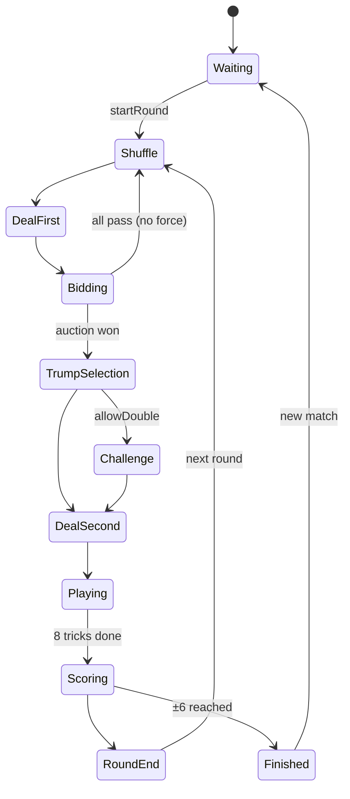

# Game Flow

## Per-trick

1. Leader plays any card.
2. Others must follow suit if able.
3. On fail-to-follow, trump may auto-reveal.
4. Fourth card → resolve winner → award points → winner leads.
5. Trick 8 (+1 last-trick bonus) → scoring.

## Engine commands map

| Phase | Commands |
|-------|----------|
| Waiting / RoundEnd | `startRound` |
| Bidding | `bid`, `pass` |
| TrumpSelection | `chooseTrump` |
| Challenge | `double`, `redouble`, `passChallenge` |
| Playing | `playCard`, `revealTrump`, `declareMarriage` |
| Any (debug) | `undo`, `saveGame` |
